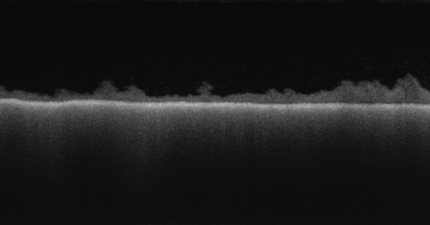
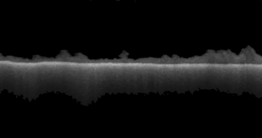
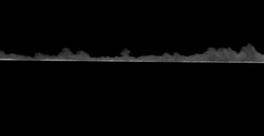
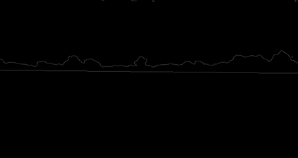
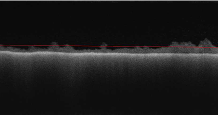

# Using Edge Detection Algorithm to Determine Bio-Film Thickness

## Introduction
Edge detection is a fundamental image processing technique that involves identifying edges, curves, and discontinuities in the brightness of a digital image. It is used for image segmentation and data extraction in areas such as image processing, computer vision, and machine vision. In this project, the objective is to apply an edge detection algorithm to determine the average thickness of biofilm from a 2D-OCT scan.

## Materials and Methodology
This project uses `opencv-python` and `numpy` libraries, which contain all the required tools for this project. Before applying the edge detection algorithm, some preprocessing and denoising were required to get the desired output.

### Preprocessing
Initially, the input scans were 2D-OCT scans in TIFF format with dimensions of 9064 pixels in height and 9722 pixels in width. To isolate the membrane and biofilm part from the scans, the images were cropped to a height of 4800 pixels using array slicing. Given that the pixel to µm ratio was 3.3324 (a scaler value obtained from ImageJ software), the images were resized to standardize the pixel to µm ratio using the `cv2.resize` method. The images were then rotated 180 degrees using the `cv2.rotate` method so that the biofilm was facing upwards. After this preprocessing, an example resulting image is shown in Figure 1.

### Denoising
Some filters were applied to the image to get rid of the noise. A non-local means denoising (`cv2.fastNlMeansDenoising`) method and Gaussian blurring (`cv2.GaussianBlur`) method were applied. A range filter was used to fully distinguish the biofilm from the background. The range of (22-202) gave the lowest error among the tested options. An example resulting image after denoising is shown in Figure 2.

### Membrane Detection
The edge detection algorithm couldn’t fully distinguish the membrane from the biofilm, so another method was used to detect the membrane layer. This involved iterating over the x-axis in blocks of 10 pixels and finding the 10 blocks with the lowest values (the whiter pixels). The coordinates were saved in an array, outliers were removed, and the `np.polyfit` method was used to fit a line to the values. All pixels under that line were set to black. An example from this phase is shown in Figure 3.

### Edge Detection
Before applying the edge detection algorithm, all non-black pixels were set to white to produce cleaner edges. The Canny algorithm (`cv2.Canny`) was used with parameters `threshold1 = 80`, `threshold2 = 50`, and `apertureSize = 3`. See Figure 4 for an example.

### Calculating Average Thickness
A two-step function was used to calculate the average thickness. First, 1000 random pixel samples were taken to calculate the average height of the film. Then, iterating over the x-axis, the first three non-black pixels were found and the closest one to the averaged height was taken. Outliers were removed, and the average thickness was calculated. Figure 5 is an example of the final result after drawing a line over the average thickness of the biofilm.

### Predicting Future Measurements
A Convolutional Neural Network (CNN) model was built to predict future measurements of biofilm thickness. The model was trained on the processed images and their corresponding thickness measurements to learn patterns and make accurate predictions. This approach allows for continuous monitoring and prediction of biofilm growth, providing valuable insights for future studies.

## Results
To test the error of the results, 10 random scans were chosen, and the algorithm was applied. The average thickness of the biofilm was calculated manually using ImageJ software by applying 50 multi-points on the biofilm and 50 corresponding multi-points on the membrane, then subtracting and averaging the values. The results are shown in Figure 6.

## Conclusion
This project successfully used an edge detection algorithm to calculate the average thickness of biofilm from 2D-OCT scans after preprocessing and denoising filters. It is important to note that this approach assumes clear boundaries separating the biofilm from other elements in the scan. The average runtime for the code on a laptop with an Intel i5 4-core processor and 8GB of RAM is 10 seconds for a single image. Additionally, the CNN model provides a robust method for predicting future biofilm thickness measurements, enhancing the project's overall utility.
